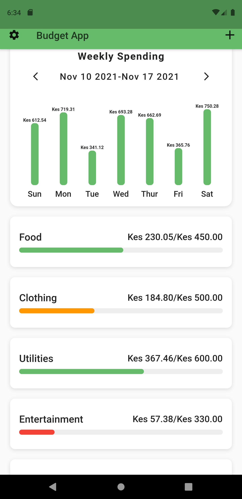
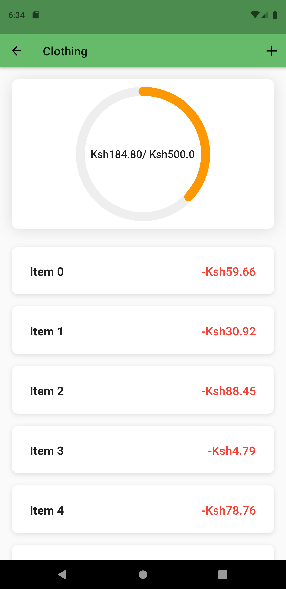
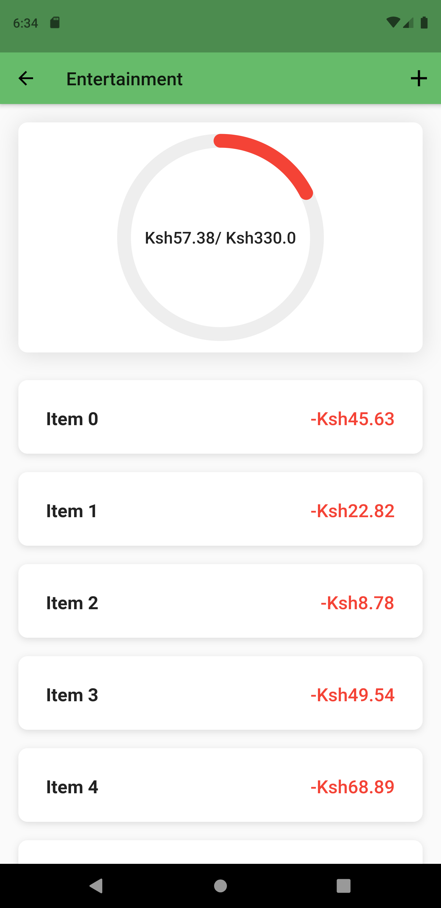

<h1>Budget_ui_app Class By Marcus Ng</h1>

This was course made by Marcus Ng the complete 
    Ui Masterclass  to show with flutter You can make Great Ui 

    <h2>What I have Learnt </h2>
    <ul>
        <li>Using Slivers and SliversAppbar</li>
        <li>How to Decorate a Container using decoration:BoxDecoration()</li>
        <li>Using Classes to Populate Data in UI still amnot yet perfect</li>
        <li>Was introduced to Custom Painter </li>
    </ul>
    <h3>That what i have learnt From this Sub Course a great course</h3>
    
    
    
    

